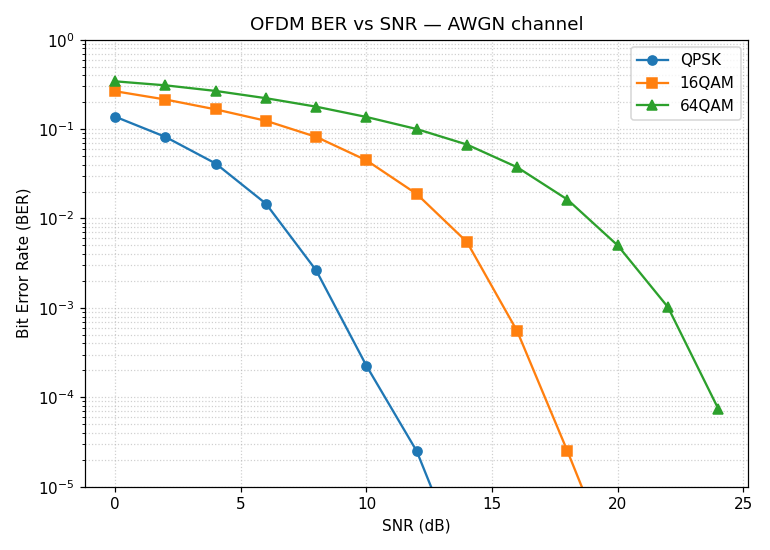
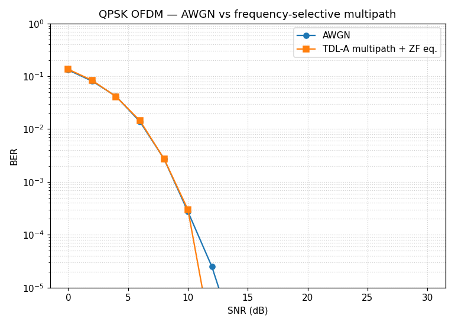
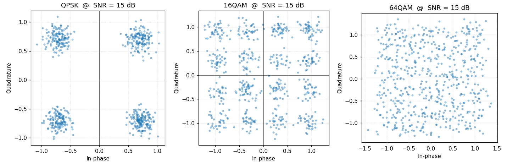
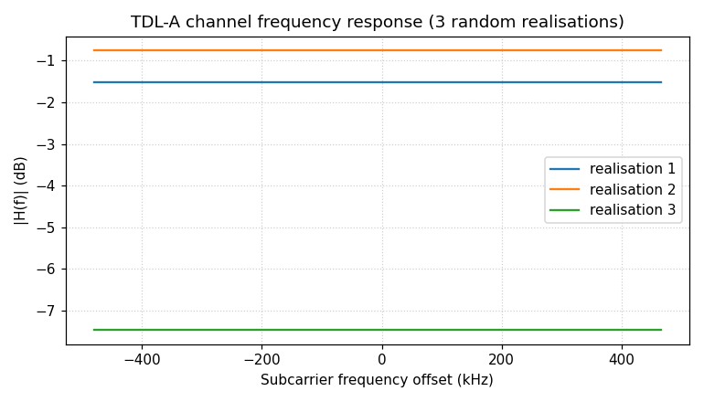

# 5g-ofdm-simulation
5G NR OFDM transceiver simulation in Python — QPSK/16QAM/64QAM modulation, cyclic prefix, AWGN &amp; multipath channel models, BER vs SNR analysis. Portfolio project for wireless/telecom engineering roles.


Frequency-selective multipath (3GPP TDL-A profile) with zero-forcing
equalisation versus AWGN-only, QPSK:



Received constellations after the OFDM RX chain at SNR = 15 dB:



TDL-A channel frequency response — note the deep fades that motivate
multi-carrier transmission with per-subcarrier equalisation:



## Project layout

```
5g-ofdm-simulation/
├── src/
│   ├── modulation.py        # QPSK / 16QAM / 64QAM Gray-coded mapper
│   ├── channel.py           # AWGN + 3GPP TDL-A multipath
│   └── ofdm_transceiver.py  # OFDM modulator, demodulator, ZF equaliser, BER sweep
├── tests/
│   └── test_ofdm.py         # 18 pytest cases covering every module
├── notebooks/
│   └── run_analysis.py      # Reproduces every plot in this README
├── results/                 # Generated PNGs (committed)
├── requirements.txt
└── LICENSE
```

## Quick start

```bash
git clone https://github.com/chethanadasari/5g-ofdm-simulation
cd 5g-ofdm-simulation
pip install -r requirements.txt

# Run the test suite
pytest tests/ -v

# Reproduce all plots in results/
python notebooks/run_analysis.py

# One-shot BER sweep
python src/ofdm_transceiver.py
```

Expected output of the last command:

```
OFDM Config: 64-pt FFT, CP=16, QPSK, fs=0.96 MHz

AWGN channel:
  SNR =   0.0 dB   BER = 0.13xxx
  ...
  SNR =  20.0 dB   BER = 0.00000
```

## Theory in one minute

OFDM splits a wideband channel into `N` orthogonal narrowband subcarriers,
each carrying one symbol per OFDM-symbol period. The inverse FFT at the
transmitter and the FFT at the receiver implement this orthogonal mapping
efficiently:

```
x[n] = (1/√N) · Σ X[k] · exp(j 2π k n / N),  k = 0 … N-1
```

A cyclic prefix (CP), a copy of the last `L` samples prepended to each block,
turns the linear convolution with the channel into a circular convolution, so
each subcarrier sees a single complex gain `H[k]`. Recovery is then a simple
per-subcarrier division (zero forcing) — see
`ofdm_transceiver.ofdm_demodulate`. The CP also absorbs symbol timing offsets
within ±L samples, which is why 5G NR uses CPs of ~7 % of the symbol length.

## Configuration

`OFDMConfig` exposes the physical-layer knobs:

| Parameter | Default | Notes |
|---|---|---|
| `n_subcarriers` | 64 | FFT size |
| `n_data_subcarriers` | 52 | Active data tones (excludes guard + DC + pilots) |
| `cp_length` | 16 | 25 % of FFT, conservative |
| `modulation` | `'QPSK'` | also `'16QAM'`, `'64QAM'` |
| `subcarrier_spacing_hz` | 15 kHz | 5G NR numerology μ = 0 |
| `pilot_subcarriers` | (-21, -7, 7, 21) | BPSK +1 reference tones |

Sample rate is `n_subcarriers × subcarrier_spacing_hz`.

## Channel models

* **AWGN** — complex Gaussian noise scaled to the requested SNR (per-sample).
* **TDL-A** — 3GPP TR 38.901 tapped-delay-line profile (low delay spread,
  sub-6 GHz). Each tap is independently Rayleigh-faded, total channel power
  normalised to unity.

## Tests

Run `pytest tests/ -v`. The suite covers:

* Constellation correctness (Gray coding, unit average power)
* Mod / demod round-trip exactness in the noiseless case
* AWGN noise-power calibration vs requested SNR
* TDL-A average power normalisation
* Cyclic-prefix correctness (lossless OFDM round-trip)
* Monotonic BER vs SNR
* Modulation-order ordering (QPSK < 16QAM < 64QAM error rate at fixed SNR)
* ZF equaliser recovery through frequency-selective fading

## Roadmap

Things that would push this further toward production-grade:

- LDPC channel coding (5G NR base graphs) and soft-decision demodulation
- MMSE equaliser + comparison vs ZF in deep fades
- Pilot-based channel estimation (LS / DFT-based) instead of perfect CSI
- 2×2 MIMO with Alamouti and spatial multiplexing
- PAPR reduction (clipping, μ-law companding, SLM)
- Real-data link with PlutoSDR or HackRF One

## License

[MIT](LICENSE)
